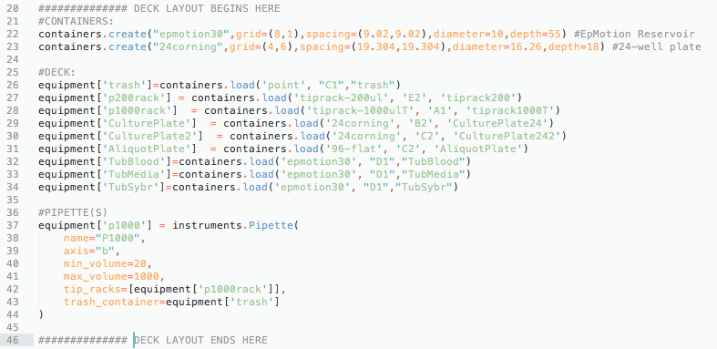
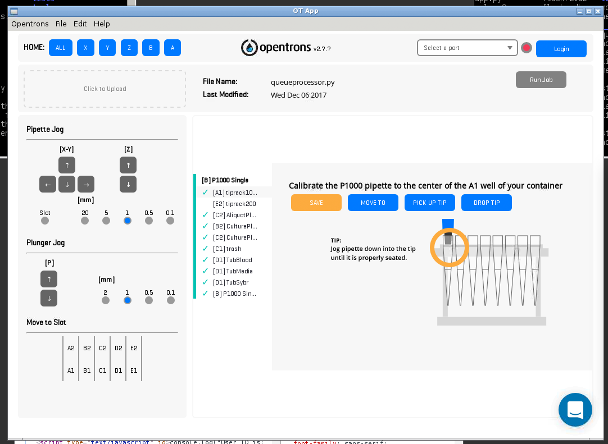

[Home](/) - [Installation](Installation.md) - Deck setup and calibration - [PlasmoTron tutorial](Tutorial.md) 

## Deck set up and calibration

This Flask app is essentially a replacement for the OpenTrons interface. In regular use you will not need to use the OpenTrons app. However you do need to use the app one more time -- to set up the layout you will use for culture.

If you have already experimented with running some protocols in OpenTrons (which you really should have before starting this!) you will be aware of how to perform calibration. First lets check you are happy with the deck setup.

Using an editor of your choice, open `queueprocessor.py` in the plasmotron directory.

Find the section where the deck layout is defined.

<p align="center">
</p>

Let's have a look at one of those lines:

```{python}
equipment['TubMedia']=containers.load('epmotion30', "D1","TubMedia")
```
The bit on the left-hand-side defines that this is a new piece of equipment called `"TubMedia"`. That name is hardcoded into other parts of the programme so you don't want to change it. There are two parts you can safely change. One is the second argument of the load function, currently `"D1"` which specifies where on the deck the container is to be found. Feel free to change these values as you wish.

The other part we could change is `"epmotion30"`. This defines the type of container that is being used which determines its geometry.

OpenTrons has a whole lot of [built-in containers](http://docs.opentrons.com/containers.html). You can see them all [here](https://andysigler.github.io/ot-api-containerviz/). You can also add your own containers, which we did in this case at the top with:

```{python}
containers.create("24corning",grid=(4,6),spacing=(19.304,19.304),diameter=16.26,depth=18) #24-well plate
```

It is important that the deck layout section defines these key components.

* **Tipbox** Where the pipette goes to collect a new tip
* **Trash** This is defined as a point in space, which should be over your trash container (the bigger the better)
* **CulturePlate** This is the primary position where you will put a culture plate to be fed, or split.
* **AliquotPlate** This is where a 96-well measurement plate will be placed to collect aliquots of the culture for measurement.
* **CulturePlate2** Sometimes we want to split from one plate into another. This is the location we will put the second plate at. It can be the same position in the deck as the AliquotPlate
* **TubMedia**,**TubBlood**, **TubSybr** These are tubs where we will get the media, blood and SYBR-green respectively. We use EpMotion 30ml reservoirs for these, but you can customise as you want. (TubSybr actually isn't important if you are happy to pre-load your Sybr-Green plates without using the robot.)

Do edit this file to suit your preferences.

When you are done, save it.

Now we are ready to calibrate. Load up the OpenTrons app. Press *Click to upload* and navigate to the plasmotron directory. Open the `queueprocessor.py` file.

If any sort of error occurs you have probably introduced an error while modifying the Deck Setup. You may want to revert to the [original file](https://github.com/theosanderson/plasmotron/blob/master/queueprocessor.py) and slowly make changes until you find the source of the problem.

But hopefully no errors occur and you are presented with a screen something like this:

<p align="center">
</p>

Now proceed to calibrate as described in the [OpenTrons documentation](https://support.opentrons.com/getting-started/software-setup/calibrating-the-deck), until every item of equipment you need to use has a green tick. 

We're now ready to close the OpenTrons app and open up the web application. If the calibration is correct we will never need the OpenTrons app again.
