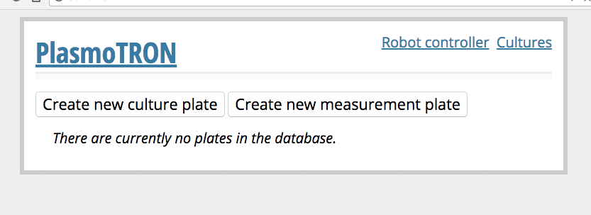
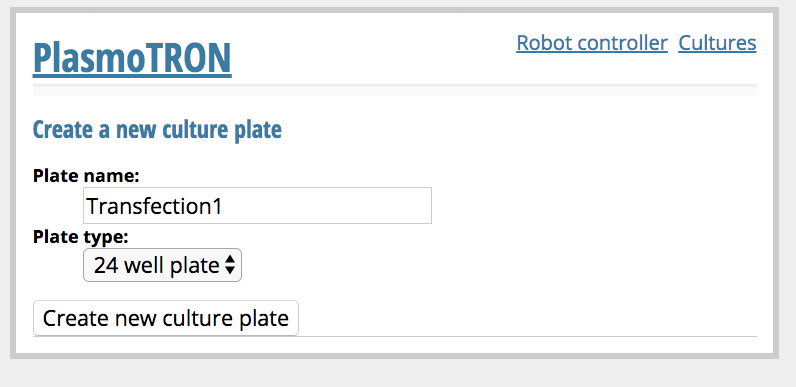
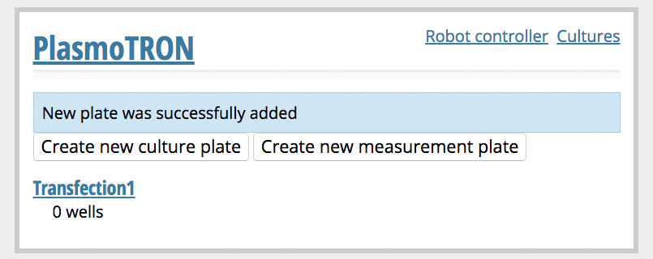
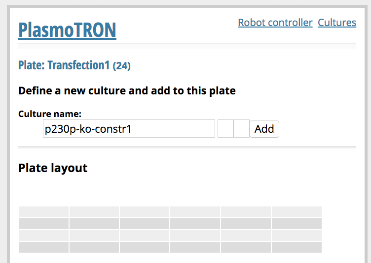
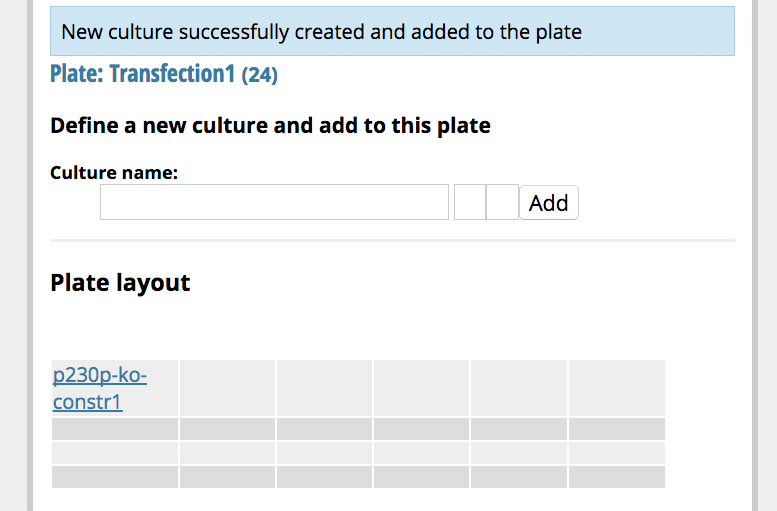
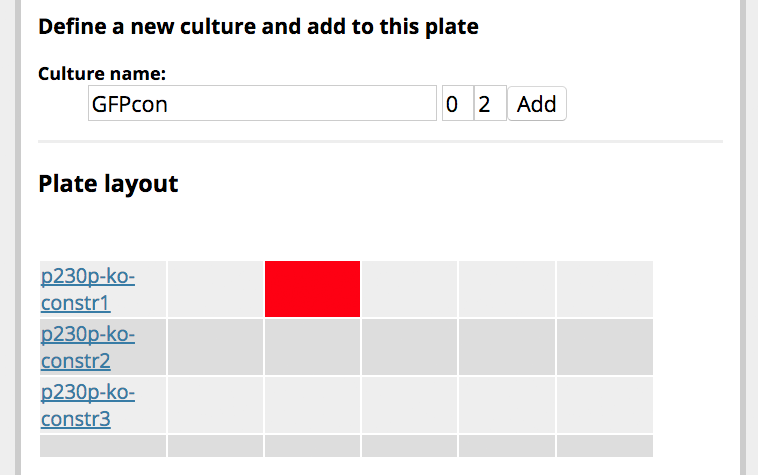

[Home](/) - [Installation](Installation.md) - [ Deck setup and calibration](DeckSetupAndCalibration.md)  - [PlasmoTron tutorial](Tutorial.md) 


### Create and populate your first plate

So once again it is
```
cd plasmotron
flask run
```

And send your browser to http://127.0.0.1:5000/

Note that if you have connected your device to the network you can also access this from a remote computer at http://[server's IP address here]:5000/

Regardless, you should get to

<p align="center">
</p>

To start off click on *Create new culture plate*. 

Give your plate a name ("tutorial plate"?), and specify its geometry (for this one use a 24-well).

<p align="center">
</p>

Press **Create plate** and you will be returned to the home-page where you will see your first cultureplate listed.

<p align="center">
</p>
 
Click on the plate. Here you can see the current cultures on the plate (there aren't any!)

<p align="center">
</p>


Add one by typing in a name and pressing add.

<p align="center">
</p>

There is our first culture. You can add more. You will notice by default that the cultures are added sequentially going top-to-bottom and then left-to-right. But you can also place a culture wherever you want - just click on a well before pressing *Add culture* and the next culture will be placed in that custom position instead.

<p align="center">
</p>

So we now have our first plate!

It is probably useful to actually physically set up this plate, so that you can carry out the next steps. Manually pipette 1 ml into each well of the plate that you indicated was filled.

Safety warning: use PlasmoTron entirely at your own risk. Robots, and biological material both pose hazards. The OpenTrons system does not have any interlocking device so do not approach the robot while it is operating. In this initial set up phase it would be prudent to use food-colouring instead of biological materials (culture) until you are confident that things are working as you intended.


### Feed your plate

Now we have a physical plate, and a virtual representation of it in the database. We're ready to use the robot to maintain our plate. Place the culture plate in the calibrated location on the deck. Also set up a full tip box (P1000 tips in this case), and your media reservoir.

When you go to the plate's page you will see options at the bottom to process the plate. Choose "Feed", by this we mean removing spent media and replacing with fresh media. You can now press "Plan plate processing".

The server will now calculate all of the commands it needs to send to the robot in order to feed the cultures on your plate. They are stored in a CommandQueue. You can see the current state of the queue at any point by pressing "Robot controller" in the top right hand corner.

First start the queue runner process by pressing "Start" on the right hand side. (The robot will home at this point.) Then Start the queue by pressing "Run queue on the left hand side". The robot should begin to move.

If anything goes wrong press Kill in the QueueRunner section. The fastest way to stop the robot is to disconnect its power supply.

### Make an aliquot plate

Some days you will be content just to feed a plate, but other days you will want to assess its parasitaemia. In the PlasmoTron approach means taking a small aliquot of the culture into a separate 96 well plate that will be measured by flow cytometry (although adaptation to a SYBR-green assay or high-content microscopy are likely possible). 

To do this you are going to actually need some parasites, so set up some dummy cultures of various parasitaemias in the same layout in a 24-well plate, and give them a few hours to settle in the incubator.

Again place your culture plate in the prime position. This time put a 96-well plate in the second plate position.

You need two reservoirs this time, one for SYBR Green (premixed to 2X concentration in PBS) and one for media.

[Then make a new measurement plate and choose feed and aliquot]

The robot will first dispense SYBR green across the measurement plate and then begin work on the culture plate.

The robot will remove spent media, replace with fresh media and then resuspend the mixture. It will then take 20ul of the mixture into the 96 well plate.


### Measure your aliquot plate

Take your aliquot plate to a flow-cytometer (taking appropriate safety measures for the fact that it contains live parasites).

Load it and acquire measurements in at least forward scatter, side scatter and SYBR Green for ~10,000 parasites per well.

Gate on RBCs in the FSC and SSC channels, then split this population into infected and uninfected cells in the SYBR-Green channel.

If you happen to have a BD CytoFlex you can find a template here.

Ultimately you need to export, either from your cytometer software or from downstream processing, a file which has well identifiers ("A1", "A2", etc,.) in one column and parasitaemia measurements in another. By default the software expects column 0 (the first column) to contain identifiers and column 7 (the 8th column) to contain parasitaemias but you can alter this by amending the configuration at the top of `app.py`.

Once the configuration is set appropriately (and the app restarted if need be), visit http://[server's IP address here]:5000/ on the cytometer computer to bring up PlasmoTron. On the home page, click on the MeasurementPlate which you created (which should now have been populated). Scroll to the bottom and press `Browse`, to find your CSV file. Then press `Upload readings`.

Readings for this measurement plate have now been captured. The plate will also be set to a finished state, meaning that the next time you attempt to take an aliquot the system will expect you to create a new plate. (Many culture plates can be measured as a batch on a single measurement plate.)

You can now click on `Cultures` in the top right of the PlasmoTron display. You will be presented with a list of your cultures ordered in descending order by parasitaemia. This ordering helps you to see which cultures might urgently need splitting. Note that the parasitaemia on this page is the expected parasitaemia *right now*, taking account of the fact that the parasites were actually removed from culture perhaps an hour ago. If you refresh this page, you may see the parasitaemia rising in front of your eyes. You can set the expected growth rate in the `app.py` configuration section.

The other way to check parasitaemia data is to navigate to your plate and click on each culture in turn. This will display the first point of what will become a graph of parasitaemia data over time.

### Split your parasites

Back on the `Cultures` display, if you see that some of your cultures are above the parasitaemia you want, you may want to split them. To do this open the plate containing these cultures and choose `Split` at the bottom. You will be asked to specify the maximum parasitaemia you want to exist on the plate.

Again place the culture plate on the primary position. You will also need to supply some blood-media mix at the same haematocrit as your culture (we use 2% haematocrit) in the TubBlood position.

Tip: if you want to achieve a very large dilution in a split it may be prudent to split to a new plate. This is because it is rarely possible to resuspend every single little bit of the culture, which may result in less dilution than you expect in extreme cases.
